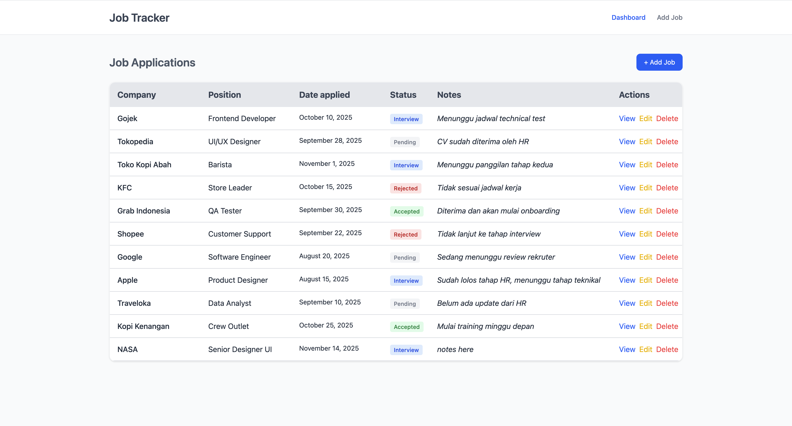

# Job Tracker V2

A simple job tracking application built with React and Vite.



## Features

-   Add, edit, and delete job entries
-   Dashboard view for job management
-   Responsive design for mobile and desktop
-   View job details

## Technologies Used

-   React
-   Vite
-   JavaScript
-   CSS

## Getting Started

### Prerequisites

-   Node.js (v14 or higher recommended)
-   npm

### Installation

1. Clone the repository:
    ```bash
    git clone https://github.com/rizalamar/job-tracker-v2.git
    ```
2. Navigate to the project directory:
    ```bash
    cd job-tracker-v2
    ```
3. Install dependencies:
    ```bash
    npm install
    ```

### Running the App

Start the development server:

```bash
npm run dev
```

Open [Demo](https://rizalamar.github.io/job-tracker-v2/) in your browser to view the app.

## Project Structure

```
src/
  assets/         # Static assets
  components/     # Reusable React components
  pages/          # Page components
  utils/          # Utility functions
  App.jsx         # Main App component
  main.jsx        # Entry point
  index.css       # Global styles
```

## License

This project is licensed under the MIT License.
